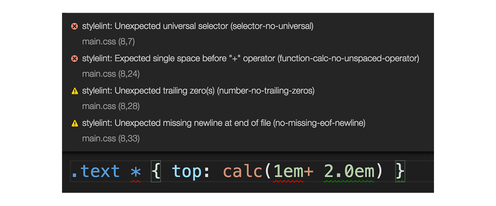

# vscode-stylelint


The official [Visual Studio Code](https://code.visualstudio.com/) extension to lint [CSS](https://www.w3.org/Style/CSS/)/[SCSS](https://sass-lang.com/documentation/syntax)/[Less](http://lesscss.org/) with [stylelint](https://stylelint.io/)



The extension first looks for a copy of stylelint installed in the open workspace folder, then for a globally installed version if it can't find one. If it can't find either, the extension uses the version of stylelint bundled with the extension (not recommended).

## Installation

1. Execute the `Extensions: Install Extensions` command from the [Command Palette](https://code.visualstudio.com/docs/getstarted/userinterface#_command-palette).
2. Type `@id:stylelint.vscode-stylelint` into the search form and install the topmost one.

Read the [extension installation guide](https://code.visualstudio.com/docs/editor/extension-gallery) for more details.

### Recommended setup (optional)


To prevent both [VS Code's built-in linters](https://code.visualstudio.com/docs/languages/css#_syntax-verification-linting) `[css]` `[less]` `[scss]` and this extension `[stylelint]` from reporting the same errors as seen in the screenshot, disable the built-in linters in either the [user or workspace settings](https://code.visualstudio.com/docs/getstarted/settings):

```json
"css.validate": false,
"less.validate": false,
"scss.validate": false
```

## Usage

Once a user follows [the stylelint startup guide](https://stylelint.io/user-guide/get-started) by creating a [configuration](https://stylelint.io/user-guide/configuration) file or by editing [`stylelint.*` VSCode settings](#extension-settings), stylelint automatically validates documents with these [language identifiers](https://code.visualstudio.com/docs/languages/overview#_language-id):


- CSS (`css`)
- HTML (`html`)
- Less (`less`)
- JavaScript (`javascript`)
- JavaScript React (`javascriptreact`)
- Markdown (`markdown`)
- [Markdown+MathML (`source.markdown.math`)](https://marketplace.visualstudio.com/items?itemName=goessner.mdmath)
- [PostCSS (`postcss`)](https://marketplace.visualstudio.com/items?itemName=mhmadhamster.postcss-language)
- [Sass (`sass`)](https://marketplace.visualstudio.com/items?itemName=Syler.sass-indented)
- SCSS (`scss`)
- styled-components
  - [Official (`source.css.styled`)](https://marketplace.visualstudio.com/items?itemName=jpoissonnier.vscode-styled-components)
  - [Userland (`styled-css`)](https://marketplace.visualstudio.com/items?itemName=mgmcdermott.vscode-language-babel)
- [Sugarss (`sugarss`)](https://marketplace.visualstudio.com/items?itemName=mhmadhamster.postcss-language)
- [Svelte (`svelte`)](https://marketplace.visualstudio.com/items?itemName=svelte.svelte-vscode)
- TypeScript (`typescript`)
- TypeScript React (`typescriptreact`)
- [Vue (`vue`, `vue-html`, `vue-postcss`)](https://marketplace.visualstudio.com/items?itemName=octref.vetur)
- XML (`xml`)
- XSL (`xsl`)

### Extension settings

Though relying on a [stylelint configuration file](https://stylelint.io/user-guide/configure) in your project is highly recommended, you can instead use the following extension [settings](https://code.visualstudio.com/docs/getstarted/settings):

#### stylelint.enable

Type: `boolean`  
Default: `true`

Controls whether this extension is enabled or not.

#### stylelint.configOverrides

Type: `Object`  
Default: `null`

Sets the stylelint [`configOverrides`](https://stylelint.io/user-guide/usage/node-api#configoverrides) option.

#### stylelint.config

Type: `Object`  
Default: `null`

Sets the stylelint [`config`](https://stylelint.io/user-guide/usage/node-api#config) option. Note that when this option is enabled, stylelint doesn't load configuration files.

#### stylelint.configFile

Type: `string`  
Default: `""`

Sets the stylelint [`configFile`](https://stylelint.io/user-guide/usage/options#configfile) option. Path to a JSON, YAML, or JS file that contains your configuration object. Use this option if you don't want stylelint to search for a configuration file.

#### stylelint.configBasedir

Type: `string`  
Default: `""`

Sets the stylelint [`configBasedir`](https://stylelint.io/user-guide/usage/options#configbasedir) option. The path to the directory to which relative paths defining "extends" and "plugins" are relative. Only necessary if these values are relative paths.

#### stylelint.syntax

Type: `"css" | "css-in-js" | "html" | "less" | "markdown" | "sass" | "scss" | "sugarss"`  
Default: `""`

Sets the stylelint [`syntax`](https://stylelint.io/user-guide/usage/options#syntax) option. Only use this option if you want to force a specific syntax.

#### stylelint.customSyntax

Type: `string`  
Default: `""`

Sets the stylelint [`customSyntax`](https://stylelint.io/user-guide/usage/options#customsyntax) option. An absolute path to a custom [PostCSS-compatible](https://github.com/postcss/postcss#syntaxes) syntax module.

e.g.

```json
  "stylelint.customSyntax": "sugarss"
```

You can use `${workspaceFolder}` to refer to the folder opened in VS Code.

e.g.

```json
  "stylelint.customSyntax": "${workspaceFolder}/custom-syntax.js"
```

#### stylelint.ignoreDisables

Type: `boolean`  
Default: `false`

Sets the stylelint [`ignoreDisables`](https://stylelint.io/user-guide/usage/options#ignoredisables) option. If `true`, stylelint ignores `styleline-disable` (e.g. `/* stylelint-disable block-no-empty */`) comments.

#### stylelint.reportNeedlessDisables

Type: `boolean`  
Default: `false`

Sets the stylelint [`reportNeedlessDisables`](https://stylelint.io/user-guide/usage/options#reportneedlessdisables) option. If `true`, stylelint reports errors for `stylelint-disable` comments that are not blocking a lint warning.

#### stylelint.reportInvalidScopeDisables

Type: `boolean`  
Default: `false`

Sets the stylelint [`reportInvalidScopeDisables`](https://stylelint.io/user-guide/usage/options#reportInvalidScopeDisables) option. If `true`, stylelint reports errors for `stylelint-disable` comments referring to rules that don't exist within the configuration object.

#### stylelint.validate

Type: `string[]`  
Default: `["css","html","javascript","javascriptreact","less","markdown","postcss","sass","scss","source.css.styled","source.markdown.math","styled-css","sugarss","svelte","typescript","typescriptreact","vue","vue-html","vue-postcss","xml","xsl"]`

An array of language identifiers specifying which files to validate.

#### stylelint.stylelintPath

Type: `string`  
Default: `""`

Used to supply a custom path to the stylelint module.

#### stylelint.packageManager

Type: `"npm" | "yarn" | "pnpm"`  
Default: `"npm"`

Controls the package manager to be used to resolve the stylelint library. This setting only has an effect if the stylelint library is resolved globally. Valid values are `"npm"` or `"yarn"` or `"pnpm"`.

#### stylelint.snippet

Type: `string[]`  
Default: `["css","less","postcss","scss"]`

An array of language identifiers specifying which files to enable snippets for.

#### editor.codeActionsOnSave

This extension provides an action that you can use with VS Code's `editor.codeActionsOnSave` setting. If provided a `source.fixAll.stylelint` property set to `true`, all auto-fixable stylelint errors will be fixed on save.

```json
  "editor.codeActionsOnSave": {
    "source.fixAll.stylelint": true
  }
```

The following turns on auto fix for all providers, not just stylelint:

```json
  "editor.codeActionsOnSave": {
    "source.fixAll": true
  }
```

You can also selectively disable stylelint:

```json
  "editor.codeActionsOnSave": {
    "source.fixAll": true,
    "source.fixAll.stylelint": false
  }
```

You can also selectively enable and disable specific languages using VS Code's language-scoped settings. For example, to disable `codeActionsOnSave` for HTML files, use the following:

```json
  "[html]": {
    "editor.codeActionsOnSave": {
      "source.fixAll.stylelint": false
    }
  }
```

### Commands

This extension contributes the following commands to the command palette:

- `Fix all auto-fixable problems`: applies stylelint resolutions to all automatically fixable problems.
